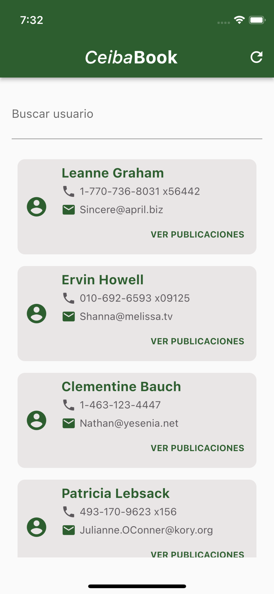

# CeibaBook

A new application to check users and posts on CeibaBook social network.

## Main Screen

The main screen shows all the users from CeibaBook. It stores the users internally on the device once it gets them from the server. 

### Search function

The user can search users using the search field. If no user is found that matches the search criteria a "No se encontró usuario con este nombre" message is shown indicating no user was found.

### User Posts

To see user information and posts, you can click on the "VER PUBLICACIONES" button inside any user card. A new screen is shown showing the user info and posts. These posts are retrieved from the server and are not persisted in the device.

